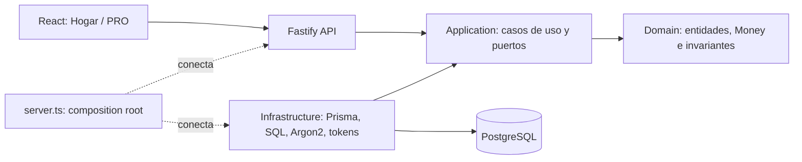
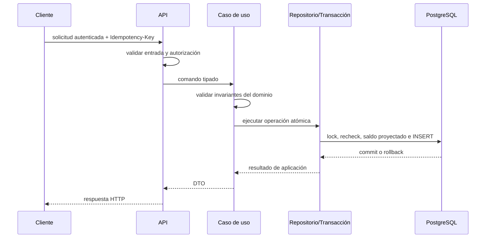
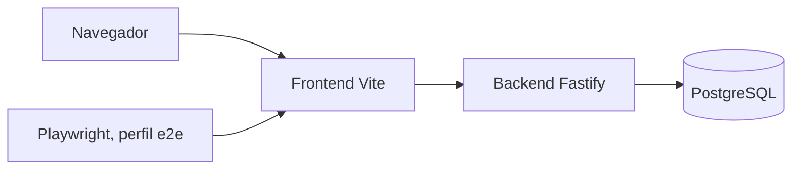

# Arquitectura de software de TADOR

**Fecha:** 2026-07-18  
**Última actualización:** 2026-07-18

TADOR adopta una arquitectura web modular orientada al dominio. Su decisión
central es separar las reglas financieras de los frameworks y de la
persistencia: Fastify, Prisma, PostgreSQL y React son mecanismos reemplazables;
las invariantes contables son el núcleo estable del sistema.

## Resumen para sustentación

| Pregunta | Respuesta |
|----------|-----------|
| ¿Qué estilo se aplica? | Clean Architecture en el backend y cliente SPA separado |
| ¿Cuál es el núcleo? | Dominio contable: dinero exacto, partida doble, periodos y políticas de saldo |
| ¿Cómo se controla el acoplamiento? | Puertos en aplicación y adaptadores en infraestructura/API |
| ¿Dónde se conectan las dependencias? | `backend/src/server.ts`, como *composition root* |
| ¿Cómo se verifica? | Tests de arquitectura, unitarios, integración y E2E |
| ¿Qué decisión guía la UI? | Dos modos —Hogar y PRO— sobre un único motor y modelo de datos |

## 1. Fundamento académico

Clean Architecture organiza el software alrededor de reglas de negocio y
establece una **regla de dependencia**: el código de las capas internas no debe
conocer detalles de las capas externas. En TADOR, esto evita que una decisión
de ORM, protocolo HTTP o librería criptográfica se convierta en una regla
contable.

La arquitectura también responde a atributos de calidad de ISO/IEC 25010:

- **mantenibilidad:** responsabilidades separadas y dependencias explícitas;
- **fiabilidad:** invariantes financieras verificadas antes de persistir;
- **seguridad:** autenticación, autorización y aislamiento por usuario en los
  límites de entrada;
- **portabilidad:** entorno reproducible con contenedores;
- **adecuación funcional:** Hogar y PRO comparten una única semántica contable.

No se afirma que una arquitectura por capas garantice por sí sola estos
atributos. La garantía práctica proviene de combinar diseño, restricciones de
dependencia, transacciones y pruebas.

## 2. Vista lógica

La flecha `Infrastructure → Application` es intencional: los repositorios y
servicios concretos implementan contratos definidos hacia el interior. El
dominio no importa Prisma, Fastify ni PostgreSQL.

### Responsabilidades por capa

| Capa | Responsabilidad | No debería contener |
|------|-----------------|----------------------|
| `domain/` | Entidades, value objects y reglas contables puras | HTTP, Prisma, SQL |
| `application/` | Casos de uso y puertos requeridos por el negocio | Detalles de framework o base de datos |
| `infrastructure/` | Repositorios Prisma/SQL y servicios técnicos | Decisiones de interfaz de usuario |
| `api/` | Autenticación, validación, adaptación HTTP y serialización | Cálculos contables duplicados |
| `server.ts` | Construcción e inyección de dependencias | Reglas de negocio |
| `frontend/` | Interacción, estado de servidor y presentación Hogar/PRO | Fuente alternativa de verdad financiera |

### Arquitectura del sistema de diseño

El frontend incorpora una cadena adicional de artefactos: los mockups de Stitch
definen referencias visuales; `DESIGN.md` normaliza identidad y tokens; los
componentes React encapsulan patrones; Storybook actúa como catálogo ejecutable;
y las páginas conectan esas piezas con rutas y API. Esta separación evita copiar
HTML de prototipo directamente al producto y permite revisar la interfaz sin
levantar todo el sistema.

El proceso se documenta en
[`diseno-visual-y-storybook.md`](diseno-visual-y-storybook.md).

## 3. Aplicación de SOLID

SOLID se usa como criterio de diseño, no como una lista de patrones obligatorios:

- **Responsabilidad única (SRP):** rutas, casos de uso, repositorios y políticas
  contables tienen motivos de cambio distintos.
- **Abierto/cerrado (OCP):** nuevos adaptadores pueden implementar puertos sin
  cambiar el caso de uso consumidor; las plantillas amplían operaciones comunes
  sin codificarlas en controladores.
- **Sustitución de Liskov (LSP):** un adaptador debe respetar el contrato y la
  semántica del puerto que implementa; las pruebas de integración validan esa
  sustitución con infraestructura real.
- **Segregación de interfaces (ISP):** los puertos son contratos enfocados en la
  necesidad del caso de uso, evitando exponer toda la API de Prisma.
- **Inversión de dependencias (DIP):** aplicación depende de abstracciones y la
  infraestructura concreta se inyecta en el *composition root*.

La principal evidencia estructural es
`backend/tests/unit/architecture-boundaries.test.ts`, que protege la dirección
de dependencias. Esta prueba no demuestra por sí sola buen diseño, pero evita
regresiones objetivas como importar Prisma desde aplicación.

## 4. Vista de ejecución de una escritura financiera

Las propiedades relevantes son:

1. **exactitud crítica:** `decimal.js` en validaciones y cuantización, con
   persistencia `NUMERIC` / Prisma `Decimal`;
2. **atomicidad de creación:** cabecera, líneas y Apunte se confirman juntos;
3. **idempotencia de creación:** una clave estable representa como máximo un
   hecho contable;
4. **concurrencia de saldo:** advisory locks serializan cuentas protegidas
   antes de V12;
5. **aislamiento por tenant:** lecturas y escrituras ordinarias filtran por
   usuario/libro.

### Límites que deben presentarse con honestidad

| Afirmación fuerte | Matiz demostrable |
|-------------------|-------------------|
| Dinero exacto end-to-end | Persistencia decimal y validaciones críticas sí; algunas agregaciones/reportes aún usan `number` |
| Toda mutación es atómica | Creación/edición/anulación de Asiento sí; `PATCH` de Apunte documenta no-atomicidad |
| Idempotencia total | Solo aplica si el cliente envía clave; unicidad actual es global |
| SOLID completo | Hay puertos, DIP y SRP parcial; no hay métrica de cumplimiento total |
| Suite siempre verde | El informe de calidad es evidencia histórica de un commit; revalidar antes de la defensa |

El detalle está en
[`motor-contable/flujo-escritura-concurrencia.md`](motor-contable/flujo-escritura-concurrencia.md).

## 5. Vista de datos y fuente de verdad

El *ledger* formado por `Asiento` y `LineaAsiento` es la fuente de verdad. Los
saldos y reportes se derivan de líneas efectivas, en lugar de mantener un total
mutable adicional. Esta decisión favorece auditabilidad y reconciliación a
cambio de realizar agregaciones en lectura y durante ciertas validaciones.

`Apunte` representa la intención cotidiana del usuario; `Asiento`, el hecho
contable. Esta separación permite que QuickAdd Hogar, EntryBuilder PRO y la
captura manual produzcan registros con las mismas invariantes.

## 6. Vista de despliegue

Docker Compose coordina estos nodos en desarrollo, con health checks,
dependencias condicionadas y volúmenes separados. El backend dispone de una
imagen multi-stage de producción y usuario no privilegiado. El frontend actual
está contenerizado para desarrollo; una imagen estática de producción y su
reverse proxy siguen siendo decisiones de despliegue.

Véase [`dockerizacion.md`](dockerizacion.md).

## 7. Decisiones y compromisos

| Decisión | Beneficio | Coste o límite |
|----------|-----------|----------------|
| Clean Architecture | Dominio independiente de frameworks | Más contratos y cableado explícito |
| Prisma + PostgreSQL | Migraciones y tipado productivos | Algunas invariantes requieren SQL/advisory locks |
| Saldos derivados | Una sola fuente reconciliable | Agregación adicional y futura necesidad de optimización |
| SPA separada | Evolución independiente de UI/API | Configuración de CORS, cookies y proxy |
| Dos modos, un motor | Sin migración al pasar de Hogar a PRO | La UI debe evitar duplicar semántica |
| Contenedores de desarrollo | Reproducibilidad | No equivalen por sí solos a un despliegue productivo |

## 8. Evidencia para evaluación

- Constitución: [`.specify/memory/constitution.md`](../.specify/memory/constitution.md).
- Decisión base: [`adr/0001-stack-architecture-and-library-baseline.md`](adr/0001-stack-architecture-and-library-baseline.md).
- Motor: [`motor-contable/README.md`](motor-contable/README.md).
- Seguridad: [`security.md`](security.md).
- Calidad y limitaciones: [`software-quality-report.md`](software-quality-report.md).
- Proceso de desarrollo: [`spec-driven-development.md`](spec-driven-development.md).

## Conclusión

La contribución arquitectónica de TADOR no consiste únicamente en separar
carpetas. Consiste en hacer explícitas y verificables las fronteras que protegen
el dato financiero: el dominio define la semántica, aplicación coordina casos de
uso, infraestructura implementa mecanismos y la API controla el acceso. Esta
estructura permite evolucionar tecnología e interfaz sin crear una segunda
verdad contable.
