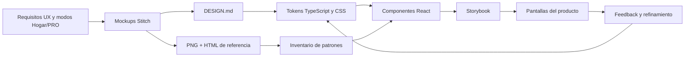

# De mockups de Stitch a biblioteca de componentes

**Fecha:** 2026-07-18

**Última actualización:** 2026-07-19

El frontend de TADOR no se diseñó directamente dentro de las pantallas
productivas. Primero se definieron requisitos de experiencia, luego se crearon
mockups navegables con Stitch y, a partir de sus patrones repetidos, se
construyó una biblioteca de componentes React documentada en Storybook.

Este proceso permitió separar tres preguntas:

1. **¿Cómo debe sentirse el producto?** — lenguaje visual y experiencia.
2. **¿Qué patrones son reutilizables?** — sistema de diseño y componentes.
3. **¿Cómo se conecta con el negocio real?** — páginas, rutas, API y estado.

## Flujo de diseño e implementación



La transformación no fue una conversión automática de HTML a React. Los
mockups funcionaron como evidencia visual y herramienta de exploración; el
equipo extrajo decisiones, eliminó duplicación y adaptó cada patrón a
accesibilidad, responsive design, contratos de componentes y datos reales.

## 1. Etapa de especificación visual

La entrada inicial fue
[`specs/foundation/mockup/spec-tecnica-mockup.md`](../specs/foundation/mockup/spec-tecnica-mockup.md),
que describe rutas, vistas, contenido, estados y restricciones del prototipo.
Esta especificación separa el comportamiento esperado de una implementación
concreta.

Stitch produjo artefactos versionados bajo
`specs/foundation/mockup/stitch/`:

- capturas `screen.png` para validar composición y jerarquía;
- prototipos `code.html` para inspeccionar estructura e interacción;
- `DESIGN.md` como fuente canónica de color, tipografía, espaciado, formas,
  elevación y tono de comunicación;
- mockups de landing, autenticación, onboarding, dashboards, apuntes, cuentas,
  entidades, configuración y flujos PRO.

Versionar estos artefactos en el repositorio conserva la trazabilidad entre
intención visual e implementación y evita que el conocimiento del diseño
dependa exclusivamente de una herramienta externa.

## 2. Normalización del sistema de diseño

Los mockups contenían soluciones visuales particulares. Antes de implementarlas
se identificaron reglas comunes y se normalizaron como tokens:

| Decisión | Fuente | Implementación |
|----------|--------|----------------|
| Paleta Teal y superficies cálidas | `stitch/DESIGN.md` | `frontend/src/design/tokens.ts`, `globals.css` |
| Manrope para titulares | `DESIGN.md` | tokens tipográficos y CSS |
| Work Sans para cuerpo | `DESIGN.md` | tokens tipográficos y CSS |
| Cuadrícula base de 8 px | `DESIGN.md` | escala de espaciado |
| Bordes redondeados y sombras suaves | mockups + `DESIGN.md` | utilidades Tailwind y componentes |
| Español neutro y tono cercano | guía de marca | textos de interfaz |

Esta etapa convierte ejemplos concretos en un vocabulario visual reutilizable.
Los tokens reducen valores arbitrarios, facilitan consistencia y permiten
cambiar la identidad visual sin editar cada pantalla por separado.

## 3. Inventario y extracción de componentes

El catálogo vivo se mantiene en
[`frontend/docs/component-inventory.md`](../frontend/docs/component-inventory.md).
Allí se registra para cada pieza su propósito, estados, propiedades, mockup de
origen, ubicación en código y story asociada.

La extracción sigue una regla práctica:

- si un patrón aparece en varias vistas o expresa una regla estable, se
  convierte en componente;
- si solo organiza una pantalla específica, permanece en la página hasta que
  exista repetición real;
- las reglas contables no se trasladan al componente: permanecen en
  backend/dominio;
- los elementos experimentales, como la mascota o IA, se conservan separados
  del MVP funcional.

Ejemplos:

| Familia | Componentes o patrones |
|---------|------------------------|
| Fundamentos | paleta, tipografía y principios de diseño |
| Entradas | botones, campos, validaciones y formularios |
| Navegación | headers, sidebar, barra móvil y AppShell |
| Hogar | onboarding, panel PYG, posición y captura de apuntes |
| PRO | EntryBuilder y árbol de cuentas |
| Finanzas | filas bancarias, widgets y visualizaciones |
| Marketing | landing, beneficios, FAQ y CTA |

## 4. Storybook como especificación ejecutable

Storybook permite renderizar componentes fuera de las páginas y del backend.
La configuración vive en `frontend/.storybook/` y usa React + Vite, autodocs,
controles, fondos de marca y `MemoryRouter` para componentes con navegación.

La biblioteca cuenta con once grupos de stories:

- `Foundations/Branding`;
- `Inputs/Patterns`;
- `Navigation/Shells`;
- `Hogar/P0 Foundations`;
- `Dashboard/Widgets`;
- `Financial/Account Banking`;
- `DataViz/Advanced`;
- `Marketing/Landing`;
- `PRO/EntryBuilder`;
- `PRO/AccountsTreePro`;
- `Mascot/Pacho` como experimento post-MVP.

```bash
cd frontend
npm run storybook        # catálogo interactivo en http://localhost:6006
npm run build-storybook  # exportación estática
```

Storybook cumple cuatro funciones:

1. **documentación:** muestra estados y variantes sin leer implementación;
2. **aislamiento:** permite desarrollar UI sin depender de API o navegación
   completa;
3. **revisión:** facilita comparar componentes con los mockups de Stitch;
4. **reutilización:** hace visible lo que ya existe antes de crear otra variante.

No sustituye pruebas de comportamiento ni accesibilidad. En el estado actual no
hay regresión visual automatizada con Chromatic o snapshots; esa capacidad está
registrada como mejora futura.

## 5. De componentes a pantallas reales

El inventario de Sprint 006 enlaza ruta, mockup, requisito y API:
[`specs/006-frontend-hogar/inventory-vistas-endpoints.md`](../specs/006-frontend-hogar/inventory-vistas-endpoints.md).

Este mapa permitió implementar progresivamente:

- las vistas públicas desde los mockups de landing y autenticación;
- onboarding responsive desde sus variantes móvil y escritorio;
- dashboard Hogar desde `dashboard_hogar_tador`;
- QuickAdd desde `apuntes_tador`;
- cuentas, entidades y configuración desde sus referencias homónimas;
- flujos PRO utilizando componentes y densidad visual específicos del modo.

Los mockups no se aplicaron de forma literal. Se adaptaron cuando el alcance del
MVP, la accesibilidad, los contratos de API o la distinción Hogar/PRO exigían un
comportamiento diferente. Por ejemplo, Pacho y el asistente de IA quedaron fuera
de las vistas funcionales aunque existen referencias experimentales.

## 6. Relación con Spec-Driven Development

El diseño visual forma parte de la trazabilidad SDD:

| Nivel | Artefacto |
|-------|----------|
| Necesidad | historias y requisitos de las specs 006/007 |
| Exploración | mockups Stitch |
| Decisiones visuales | `stitch/DESIGN.md` |
| Contrato reusable | inventario de componentes |
| Evidencia ejecutable | stories |
| Integración | páginas React conectadas con rutas y API |
| Verificación | pruebas frontend y recorridos E2E |

Esta cadena reduce el salto entre una imagen aprobada y código mantenible. El
mockup responde a la intención; Storybook formaliza las piezas; las pantallas
verifican su utilidad dentro del producto.

## 7. Beneficios y limitaciones

| Aspecto | Beneficio | Límite actual |
|---------|-----------|---------------|
| Stitch | exploración visual rápida y cobertura de múltiples vistas | HTML generado no es código productivo |
| Tokens | consistencia y cambios centralizados | requieren disciplina para evitar valores ad hoc |
| Componentes | reutilización y menor duplicación | una abstracción prematura puede complicar la API |
| Storybook | documentación ejecutable y desarrollo aislado | no hay publicación ni regresión visual en CI |
| Inventario | trazabilidad y descubrimiento | algunos estados históricos pueden quedar desactualizados |

## Evidencia principal

- [Especificación técnica del mockup](../specs/foundation/mockup/spec-tecnica-mockup.md)
- [Sistema visual generado desde Stitch](../specs/foundation/mockup/stitch/DESIGN.md)
- [README del frontend](../frontend/README.md)
- [Inventario de componentes](../frontend/docs/component-inventory.md)
- [Mapa de vistas, mockups y endpoints](../specs/006-frontend-hogar/inventory-vistas-endpoints.md)
- Stories en `frontend/src/stories/`
- Configuración en `frontend/.storybook/`

## Conclusión

El aporte de Stitch no fue únicamente producir pantallas atractivas. Sirvió como
fase de exploración dentro de un proceso de ingeniería: sus mockups se
convirtieron en decisiones de diseño versionadas, tokens reutilizables,
componentes React y documentación ejecutable en Storybook. El resultado es una
biblioteca visual que reduce inconsistencias y permite evolucionar las
experiencias Hogar y PRO sin duplicar toda la interfaz.
