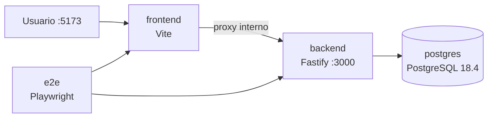
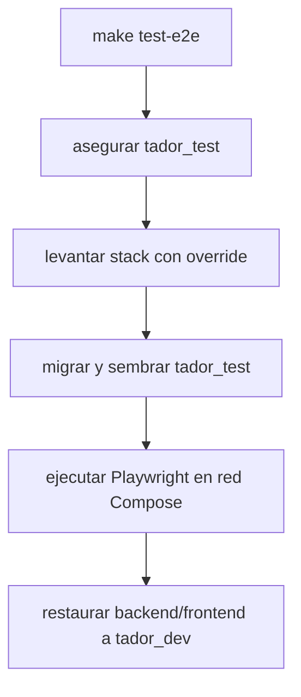

# Dockerización y reproducibilidad de TADOR

**Fecha:** 2026-07-18  
**Última actualización:** 2026-07-18

TADOR usa Docker y Docker Compose para reproducir el entorno de desarrollo y
aislar las pruebas que requieren infraestructura real. La contenerización
actual cubre PostgreSQL, backend, frontend y Playwright E2E; no debe confundirse
con una plataforma de producción completamente definida.

## Resumen para sustentación

| Objetivo | Implementación |
|----------|----------------|
| Mismo runtime | Imágenes Node.js 22 Alpine para backend/frontend |
| Dependencias deterministas | `npm ci` + lockfiles |
| Orquestación local | `compose.yaml` |
| Orden de arranque | health checks + `depends_on: condition: service_healthy` |
| Persistencia local | volumen nombrado `postgres_data` |
| Hot reload | bind mounts de código + volúmenes de `node_modules` |
| Pruebas aisladas | `compose.e2e.yaml` dirige backend a `tador_test` |
| Automatización | Makefile como interfaz estable de comandos |

## 1. Fundamento académico

La portabilidad no significa que un contenedor se comporte idénticamente en
cualquier infraestructura. La contribución de Docker es encapsular runtime,
dependencias del sistema y comandos de arranque, reduciendo la variabilidad
entre equipos y entre ejecuciones.

En términos de ISO/IEC 25010, esta estrategia aporta principalmente:

- **portabilidad/adaptabilidad:** servicios declarados como imágenes y
  configuración externa;
- **instalabilidad:** arranque coordinado mediante Compose;
- **fiabilidad:** health checks y dependencias saludables;
- **mantenibilidad:** comandos repetibles y separación de perfiles;
- **seguridad:** menor superficie en la imagen backend de producción y usuario
  sin privilegios.

## 2. Topología de contenedores



`compose.yaml` define cuatro servicios:

1. `postgres`: base de desarrollo y creación inicial de `tador_test`;
2. `backend`: API con código montado, Prisma y hot reload;
3. `frontend`: SPA Vite con proxy al nombre DNS `backend`;
4. `e2e`: runner opcional, habilitado por el perfil `e2e`.

Compose aporta DNS interno por nombre de servicio. Por eso el frontend usa
`http://backend:3000` dentro de la red, no `localhost`.

## 3. Estrategia de imágenes

### Backend

`backend/Dockerfile` es multi-stage:

- `development`: instala dependencias, genera Prisma Client y ejecuta modo watch;
- `builder`: compila TypeScript en una etapa separada;
- `production`: copia artefactos, instala solo dependencias de producción y
  ejecuta como `appuser`, no como root.

Esta separación mejora caché y reduce herramientas innecesarias en runtime. La
imagen productiva existe, pero su operación todavía requiere definir migración,
hosting, observabilidad, TLS, backups y estrategia de rollback.

### Frontend

`frontend/Dockerfile` está orientado a desarrollo: instala dependencias y
ejecuta Vite sobre `0.0.0.0`. No es una imagen final para servir archivos
estáticos en producción. El despliegue deberá construir la SPA y servirla desde
un hosting estático o reverse proxy con cabeceras de seguridad.

### E2E

`frontend/Dockerfile.e2e` parte de la imagen oficial de Playwright, que incluye
navegador y dependencias del sistema. Esto elimina la necesidad de instalar
Chromium en el host y hace más repetible la suite.

## 4. Configuración, datos y secretos

Compose aplica configuración por variables de entorno. Solo valores `VITE_*`
deben llegar al navegador; credenciales de base de datos y `SESSION_SECRET`
permanecen en backend/infraestructura.

| Recurso | Estrategia | Propósito |
|---------|------------|-----------|
| Código fuente | bind mounts | iteración y hot reload |
| `node_modules` | volúmenes nombrados | evitar incompatibilidad host/contenedor |
| PostgreSQL | `postgres_data` | conservar desarrollo entre reinicios |
| Configuración local | `.env` gitignored | separar valores del manifiesto |
| Staging/producción | secret manager de plataforma | evitar secretos en imagen o repositorio |

Los valores por defecto de desarrollo —incluido
`change-me-in-production`— facilitan el arranque local, pero son inseguros para
un despliegue público. Producción debe fallar si recibe secretos débiles o
ausentes; ese endurecimiento es una responsabilidad de despliegue.

Véase [`environment-files.md`](environment-files.md).

## 5. Aislamiento de pruebas

Las pruebas E2E reutilizan la topología de la aplicación, pero
`compose.e2e.yaml` sobrescribe `POSTGRES_DB` con `tador_test`.



El aislamiento impide que una suite destructiva borre datos de desarrollo. La
configuración de Vitest añade otra defensa: rechaza arrancar si la URL apunta a
`tador_dev` o `postgres`.

## 6. Operación local

```bash
cp .env.example .env
make db-setup
make up
```

Servicios esperados:

- frontend: `http://localhost:5173`;
- backend: `http://localhost:3000`;
- health del backend: `http://localhost:3000/health`;
- PostgreSQL: `localhost:5432`.

Comandos relevantes:

```bash
make ps
make logs
make test-unit
make test
make test-frontend
make test-e2e
make down
```

El Makefile reduce carga cognitiva y desacopla al desarrollador de comandos
largos de Compose. No oculta la infraestructura: cada target sigue siendo
inspeccionable.

## 7. Relación con integración continua

GitHub Actions no ejecuta toda la aplicación con Compose. Instala Node.js y
levanta PostgreSQL como servicio del job, luego corre typecheck, lint, unitarias,
integración y cobertura. Esto valida el mismo contrato de base de datos con una
estrategia más simple para CI.

Los E2E permanecen locales y no son un gate de cada pull request. Es una
limitación explícita, no una cobertura inexistente.

## 8. Riesgos y trabajo pendiente para producción

| Riesgo o brecha | Estado actual | Próximo control |
|-----------------|---------------|-----------------|
| Frontend servido por Vite | adecuado para desarrollo | build estático + proxy/CDN |
| Secretos con defaults locales | conveniencia local | validación estricta + secret manager |
| TLS y cabeceras del frontend | fuera de Compose local | terminación HTTPS y headers en proxy |
| Backups de PostgreSQL | no definidos en el repo | política de backup y restauración probada |
| Migraciones al desplegar | comando disponible | job de release con rollback definido |
| Observabilidad | logs básicos | métricas, trazas, retención y alertas |
| Alta disponibilidad | fuera del MVP | réplicas/servicio gestionado según carga |
| E2E en CI | ejecución local | job nocturno u obligatorio según estabilidad |

## Conclusión

La dockerización de TADOR es sólida como entorno reproducible de desarrollo y
pruebas: fija runtimes, coordina dependencias saludables y separa bases de
datos. Su presentación académica debe distinguir esta evidencia de una
afirmación más amplia de “producción lista”. El siguiente nivel no es añadir
más contenedores, sino diseñar operación segura: despliegue, secretos,
observabilidad, backups y recuperación.
