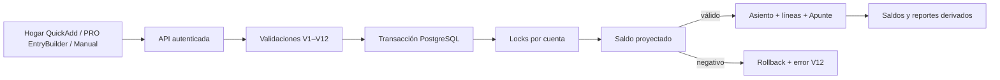

# Motor contable: resumen

**Fecha**: 2026-07-18  
**Última actualización**: 2026-07-18

El motor contable convierte intenciones (Apuntes, plantillas o asientos
manuales) en un libro de partida doble. El ledger —Asiento y Línea de Asiento—
es la única fuente de verdad: los saldos y reportes se calculan desde sus
líneas, no desde totales mutables.

## Lectura rápida

1. Todo asiento debe tener dos o más líneas y débitos = créditos.
2. Asiento + líneas (+ Apunte cuando aplica) se escriben atómicamente.
3. La Idempotency-Key evita duplicados secuenciales y concurrentes.
4. V12 bloquea saldos naturales negativos en cuentas protegidas.
5. PostgreSQL serializa por cuenta solo a los escritores que compiten.
6. Los saldos se derivan en tiempo real; no hay trigger, columna de saldo ni
   vista materializada.

## Documentos

- [Arquitectura y capacidades](arquitectura-y-capacidades.md): componentes,
  límites y modelo contable.
- [Flujo de escritura, concurrencia e idempotencia](flujo-escritura-concurrencia.md):
  secuencia exacta de una mutación.
- [Saldos derivados y política no-negativa](saldos-y-politica-no-negativa.md):
  cálculo, familias protegidas, toggle y alternativas descartadas.

## Decisiones vinculadas

- [ADR 0003](../adr/0003-idempotent-concurrent-accounting-writes.md)
- [ADR 0004](../adr/0004-derived-balances-and-concurrent-overdraft-guard.md)
- [ADR 0005](../adr/0005-text-cuid-primary-keys-for-ledger.md) — IDs de texto (CUID)
  para Asiento y LineaAsiento
