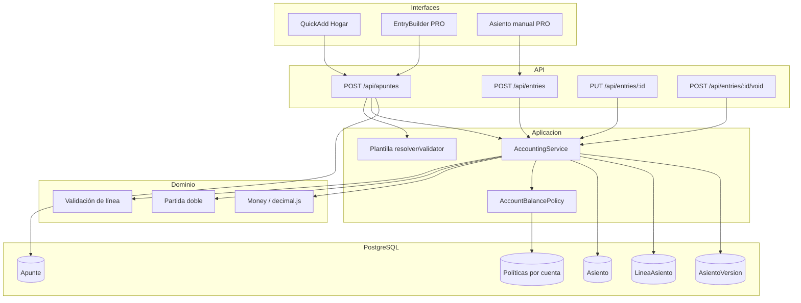

# Motor contable: arquitectura y capacidades

**Fecha**: 2026-07-18  
**Última actualización**: 2026-07-18

## Qué hace

El motor recibe hechos económicos, valida sus invariantes y persiste un ledger
auditable. Apunte es la intención del usuario; Asiento es el hecho contable.
Una plantilla prepara líneas, pero nunca sustituye las validaciones del motor.

## Capacidades actuales

| Capacidad | Garantía |
|-----------|----------|
| Partida doble | Débitos y créditos iguales con precisión decimal |
| Postabilidad | Solo cuentas válidas, activas y tenant-safe |
| Periodos | Crear, cerrar y reabrir ejercicios anuales |
| Auditoría | Versiones al editar; original y reversa al anular |
| Idempotencia | Una clave representa como máximo un Asiento |
| Concurrencia de saldo | Serialización por cuenta antes de validar V12 |
| Saldos | Actual y mensual derivados desde líneas efectivas |
| Reportes | PYG, Balance, posición y análisis derivados |
| Adaptación | Apuntes con/sin plantilla sobre el mismo ledger |

## Componentes

## Modelo de verdad

- `Asiento`: cabecera, fecha, concepto, tipo, clave idempotente y estado de
  anulación.
- `LineaAsiento`: cuenta + débito/crédito exactos.
- `Apunte`: intención de captura vinculada uno-a-uno al Asiento.
- `AsientoVersion`: snapshot previo a una edición.
- `CuentaUsuario` / `ActivacionCuentaGlobal`: configuración de V12.

No existe un campo `saldo`. El saldo visible es una proyección del ledger.

## Identificadores del ledger

Los IDs de `Asiento` y `LineaAsiento` son **texto** (`String` / PostgreSQL
`TEXT`), generados con CUID (`@default(cuid())`). No son enteros secuenciales.

Motivo: el identificador es opaco (no revela volumen ni permite enumerar
`/api/entries/1…n`), no requiere una secuencia central bajo escrituras
concurrentes, y mantiene el mismo sistema de identidad que el resto del
esquema (Book, cuentas, Apunte, periodos). El orden contable y cronológico
sale de `fecha` / `createdAt`, nunca del ID.

Detalle y alternativas descartadas: [ADR 0005](../adr/0005-text-cuid-primary-keys-for-ledger.md).

## Anulación efectiva

Al anular:

1. se conserva y marca el original;
2. se crea la reversa para auditoría;
3. las lecturas efectivas excluyen el original anulado y la reversa vinculada;
4. el efecto visible vuelve a cero;
5. V12 valida el estado que queda después de retirar el original.

Esto evita que una reversa auditiva vuelva a impactar reportes cuando el
original ya fue excluido.
