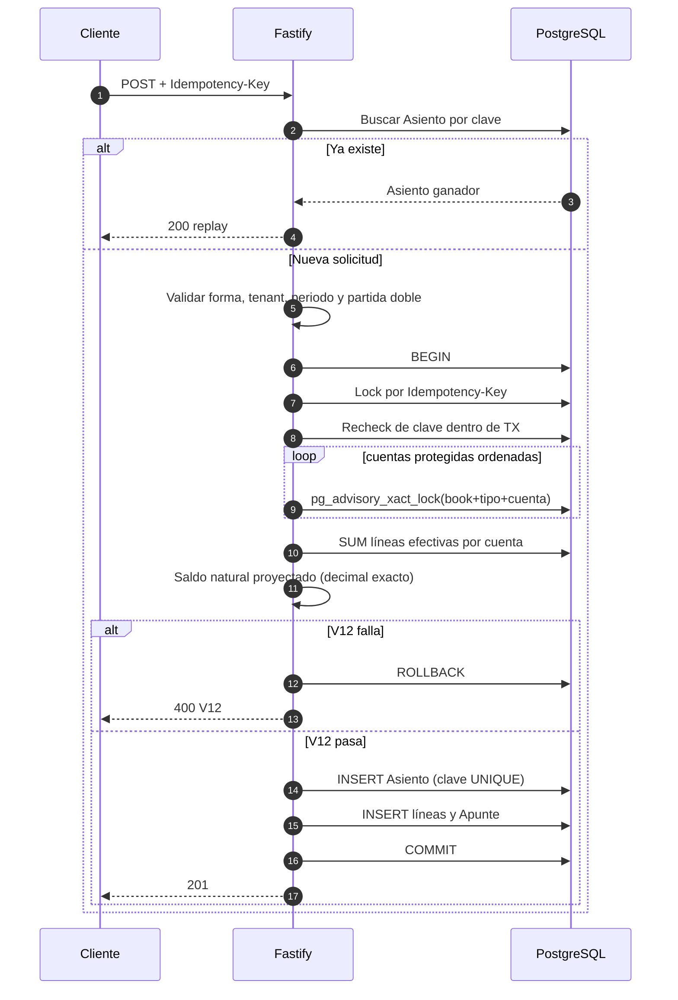
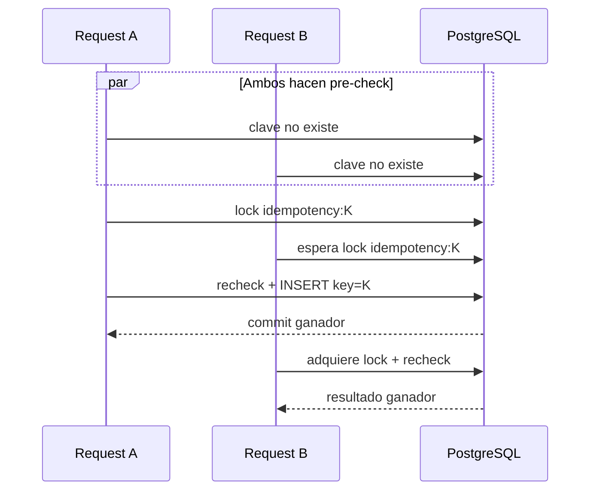

# Motor contable: flujo de escritura, concurrencia e idempotencia

**Fecha**: 2026-07-18  
**Última actualización**: 2026-07-18

## Resultado

Una creación con Idempotency-Key confirma como máximo un hecho contable. Una
cuenta protegida no puede sobregirarse por dos solicitudes concurrentes porque
la lectura del saldo y la escritura ocurren bajo el mismo lock y transacción.

## Flujo de creación

## Carrera de la misma clave

El pre-check mejora latencia. El lock por clave + recheck evita que un replay
sea reevaluado contra un saldo que el ganador ya consumió. El índice único
permanece como garantía final ante cualquier escritor compatible que no haya
tomado ese lock.

## Carrera por saldo

Sin lock, dos retiros de 80 podrían leer saldo 100 y confirmar ambos. Con el
lock:

1. A bloquea la cuenta, calcula 100 − 80 = 20 y confirma.
2. B espera.
3. Tras el commit de A, B adquiere el lock; su nueva consulta ve 20.
4. B calcula 20 − 80 = −60 y recibe V12.

El aislamiento permanece en `READ COMMITTED`; cada consulta posterior al lock
ve el último commit. No se necesita elevar toda la transacción a `SERIALIZABLE`.

## Atomicidad

- `POST /api/entries`: Asiento + líneas en una transacción.
- `POST /api/apuntes`: Asiento + líneas + Apunte en una transacción.
- Edición: versión + reemplazo de líneas + cabecera en una transacción.
- Anulación: validación post-anulación + reversa + marca del original en una
  transacción.

Una excepción aborta todo y los advisory locks se liberan automáticamente.

## Responsabilidad del frontend

Hogar QuickAdd, PRO EntryBuilder y PRO manual:

1. crean una UUID al iniciar el envío;
2. la conservan si el intento falla;
3. la reutilizan al reintentar;
4. la limpian únicamente después del éxito.

El botón deshabilitado evita dobles clics comunes; la clave protege los casos
que la UI no puede controlar (red, proxy, múltiples pestañas o concurrencia).
