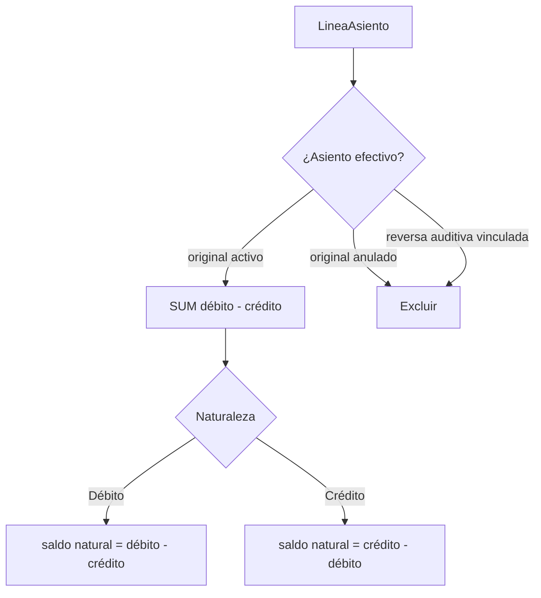
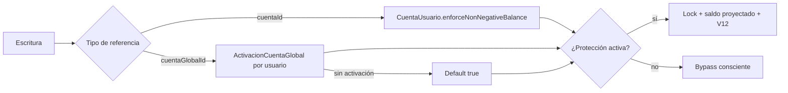

# Motor contable: saldos derivados y política no-negativa

**Fecha**: 2026-07-18  
**Última actualización**: 2026-07-18

## Decisión

Los saldos se calculan desde líneas efectivas en cada lectura. V12 usa el mismo
cálculo dentro de la transacción de escritura, después de serializar por cuenta.
No se usa trigger, columna de saldo, vista ni vista materializada.

## Cómo se calcula

## Familias protegidas

| Código | Familia | Naturaleza | Ejemplo de rechazo |
|--------|---------|------------|--------------------|
| `1111` | Efectivo y billeteras | Débito | gastar más efectivo del registrado |
| `1112` | Bancos | Débito | transferencia que sobregira banco |
| `1132` | CxC personales | Débito | cobrar más de lo que la persona debe |
| `2112` | CxP personales | Crédito | pagar más de lo que se debe |
| `2120` | Tarjetas | Crédito | abonar más que la deuda registrada |

La regla compara contra cero después de cuantizar a la moneda del libro.

## Cuenta de usuario vs cuenta global

Una `CuentaGlobal` es compartida por catálogo; por eso su preferencia no se
guarda en la cuenta global. Se guarda en la activación del usuario. Si todavía
no existe activación, la protección efectiva es `true`.

## Toggle de usuario

En Cuentas PRO aparece **Impedir saldo negativo** para familias protegidas:

- activado (default): V12 bloquea la operación;
- desactivado: permite negativo únicamente en esa cuenta;
- el cambio de política toma el mismo advisory lock que una escritura;
- desactivar no corrige ni altera asientos existentes.

El toggle es una excepción de conciliación, no una forma de crédito. Tarjetas y
deudas usan su naturaleza crédito; “negativo” significa cruzar por debajo de
cero en esa naturaleza, no el signo técnico `débito - crédito`.

## Por qué no se materializa el saldo

| Alternativa | Ventaja | Costo / riesgo |
|-------------|---------|----------------|
| Saldo derivado + lock (actual) | Ledger único, reconciliable, cambio pequeño | Agregado adicional al escribir |
| Columna de saldo | Lectura O(1) | Estado duplicado y riesgo de desincronización |
| Trigger | Garantía para SQL externo | Lógica contable oculta y despliegue más complejo |
| Vista materializada | Lecturas analíticas rápidas | No sirve para validación transaccional en tiempo real |
| `SERIALIZABLE` global | Semántica fuerte | Abort/retry y contención más amplios |

Para el volumen MVP, el agregado bajo lock es suficientemente simple y seguro.
Si el volumen crece, se puede introducir un snapshot de saldo reconciliable sin
cambiar la semántica pública de V12.
