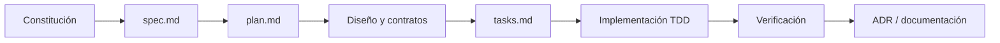

# Spec-Driven Development en TADOR

**Fecha:** 2026-07-18  
**Última actualización:** 2026-07-18

TADOR utiliza Spec-Driven Development (SDD) para convertir necesidades de
producto en artefactos verificables antes de escribir código. Cada incremento
relevante se expresa como una capacidad acotada con especificación, plan,
tareas, criterios de aceptación y evidencia de pruebas.

## Resumen para sustentación

El valor académico del proceso es la **trazabilidad**: una decisión puede
seguirse desde el principio rector y el requisito, hasta la tarea, el código y
la prueba que aporta evidencia.

## 1. Qué se entiende por SDD

SDD desplaza parte de la validación hacia el inicio del ciclo. La especificación
describe **qué comportamiento y resultado se necesita**; el plan decide **cómo
se integrará técnicamente**; las tareas convierten el diseño en unidades
ejecutables. Así se reduce el riesgo de implementar una solución técnicamente
correcta para un problema mal definido.

En TADOR no reemplaza TDD. Ambos operan en niveles complementarios:

| Disciplina | Pregunta principal | Evidencia |
|------------|--------------------|----------|
| SDD | ¿Estamos construyendo la capacidad correcta? | escenarios, requisitos y criterios de éxito |
| Diseño/ADRs | ¿Por qué se eligió este enfoque? | alternativas, consecuencias y decisiones |
| TDD | ¿El código cumple el comportamiento acordado? | prueba que falla, implementación y regresión |
| CI/calidad | ¿La integración conserva los acuerdos? | typecheck, lint, cobertura y suites |

## 2. Jerarquía de artefactos

### Constitución

`.specify/memory/constitution.md` contiene principios obligatorios: dos modos
sobre un motor, partida doble, aislamiento por usuario, TDD, seguridad,
concurrencia, Clean Architecture y aritmética monetaria exacta. Funciona como
restricción transversal para todos los sprints.

### Documentos fundacionales

`specs/foundation/` estabiliza vocabulario, alcance del MVP, modos Hogar/PRO,
casos canónicos, plan de cuentas, reportes y estrategia incremental. Estos
documentos evitan que cada feature redefina el negocio.

### Especificación de capacidad

Cada `specs/{número}-{capacidad}/spec.md` contiene escenarios priorizados,
requisitos funcionales, casos límite y resultados medibles. Debe poder leerse
sin depender de decisiones de framework.

### Plan técnico

`plan.md` registra contexto técnico, estructura, estrategia de pruebas y un
**Constitution Check**. Este control obliga a revisar, antes del diseño, asuntos
como tenant, integridad contable, dinero exacto, seguridad e idempotencia.

### Diseño, contratos e investigación

Según el riesgo de la capacidad, el directorio incluye `research.md`,
`data-model.md`, `contracts/`, `quickstart.md` u otros inventarios. Se documentan
alternativas y límites antes de convertirlos en tareas.

Para frontend, esta fase también produjo mockups con Stitch. Sus capturas y HTML
se conservaron como referencias, mientras `DESIGN.md`, el inventario de
componentes y Storybook transformaron la exploración visual en contratos
reutilizables. Véase
[`diseno-visual-y-storybook.md`](diseno-visual-y-storybook.md).

### Tareas

`tasks.md` ordena el trabajo por dependencias y por historias verificables. En
comportamientos críticos incluye primero las pruebas y después el código de
producción.

### ADRs

`docs/adr/` conserva decisiones que afectan más de una especificación o cuya
justificación debe sobrevivir al sprint. Por ejemplo, idempotencia concurrente,
saldos derivados y el aplazamiento de IA v0.

## 3. Ejemplo de trazabilidad: motor contable

| Nivel | Evidencia |
|-------|----------|
| Principio | Constitución II exige Asientos atómicos y balanceados |
| Escenario | Spec 003: guardar uno balanceado y rechazar uno descuadrado |
| Requisito | `FR-002`: débitos y créditos deben coincidir |
| Criterio | `SC-001`: ningún asiento descuadrado puede persistirse |
| Diseño | Plan 003 ubica reglas en dominio/aplicación y persistencia en PostgreSQL |
| Decisión | ADR 0003/0004 define idempotencia y control concurrente |
| Implementación | Servicio contable + repositorio transaccional |
| Verificación | Unitarias de dinero/invariantes e integración contra PostgreSQL |

Esta cadena es más fuerte que afirmar “el sistema funciona”: permite mostrar qué
significa funcionar y dónde se prueba.

## 4. Incrementos y estado

El proyecto sigue el principio “un sprint = una spec = una capacidad
verificable”. La secuencia cubre plataforma, catálogos, motor contable,
plantillas, reportes y las interfaces Hogar/PRO.

La numeración expresa identidad histórica, no necesariamente orden de entrega.
El directorio `008-ia-v0` se conserva, pero la capacidad fue excluida del cierre
del MVP por ADR 0002. `009-frontend-pro-avanzado` pasó a ser el incremento
activo. Esta decisión muestra una propiedad importante de SDD: cambiar alcance
de forma explícita sin borrar la historia.

> La constitución aún contiene una referencia histórica a IA v0 dentro de los
> criterios de cierre. Para el alcance vigente, ADR 0002 y los documentos de
> roadmap posteriores son la decisión aplicable. Esta divergencia se documenta
> como deuda de gobernanza y no debe ocultarse en la presentación.

## 5. Controles de calidad del proceso

- **Clarificación antes del diseño:** preguntas y respuestas quedan en la spec.
- **Criterios verificables:** los requisitos usan resultados observables y
  escenarios independientes.
- **Constitution Check:** el plan debe declarar cumplimiento o justificar una
  excepción.
- **Orden por dependencias:** las tareas fundacionales preceden las historias
  que dependen de ellas.
- **Trazabilidad de decisiones:** cambios transversales se registran en ADRs.
- **Verificación automatizada:** CI ejecuta tipado, lint, unitarias, integración
  y cobertura.
- **Documentación viva:** specs y docs se actualizan cuando una decisión cambia
  semántica o alcance.

## 6. Beneficios y límites

| Aspecto | Beneficio observado | Riesgo o límite |
|---------|---------------------|-----------------|
| Alcance incremental | Reduce el tamaño de cada decisión | Puede fragmentar la visión si no existe documentación fundacional |
| Trazabilidad | Facilita auditoría y sustentación | Requiere mantener sincronizados artefactos y código |
| Diseño anticipado | Expone riesgos contables y de seguridad | Un plan excesivo puede quedar obsoleto |
| TDD desde requisitos | Conecta pruebas con valor de negocio | Tener muchas pruebas no garantiza buenas aserciones |
| ADRs | Conservan el “por qué” | Las decisiones posteriores deben marcar qué texto anterior reemplazan |

SDD tampoco demuestra causalmente que cada acierto provenga del proceso. Su
aporte verificable es reducir ambigüedad, hacer visibles los compromisos y
permitir revisar coherencia entre intención e implementación.

## 7. Cómo presentar el proceso

1. Mostrar la constitución y explicar dos o tres principios no negociables.
2. Elegir una historia del motor contable en `spec.md`.
3. Seguirla hasta requisito y criterio de éxito.
4. Enseñar el Constitution Check y una decisión en ADR.
5. Mostrar la tarea de prueba y el test correspondiente.
6. Cerrar con la evidencia de CI y una limitación reconocida.

## Referencias internas

- [Constitución](../.specify/memory/constitution.md)
- [Especificación del motor contable](../specs/003-motor-contable/spec.md)
- [Plan del motor contable](../specs/003-motor-contable/plan.md)
- [Tareas del motor contable](../specs/003-motor-contable/tasks.md)
- [ADR 0002 — IA diferida](adr/0002-sprint-08-ia-deferred-009-pro-analysis.md)
- [Índice de documentación](README.md)
