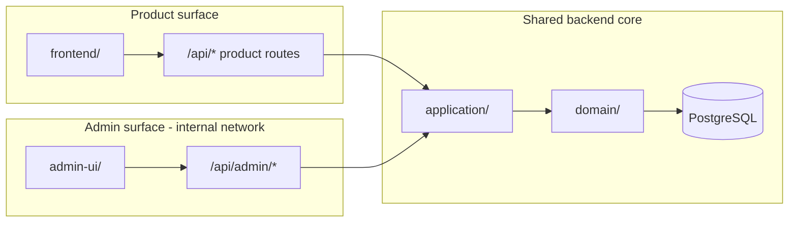

# Implementation Plan: Admin Platform (013)

**Branch**: `013-admin-platform` | **Date**: 2026-07-22 | **Spec**: [spec.md](./spec.md)

## Summary

Introduce an **internal admin platform** as a new module in the TADOR monorepo:

- `admin-ui/` — operator SPA (Mantine + Vite + TanStack Query)
- `backend/src/api/routes/admin/` — privileged HTTP surface
- `backend/src/application/admin/` — cross-tenant use cases with audit
- Shared `domain/` and `application/` rules (no direct DB bypass)

Phased delivery: foundation (auth + audit) → users → templates migration → global chart → statistics.

## Technical Context

| Area | Decision |
|------|----------|
| Language | TypeScript (ESM), same as product |
| Backend | Fastify; admin routes namespaced `/api/admin/*` |
| Frontend | React 19, Mantine, Vite — separate app `admin-ui/` |
| Auth | `Operator` model + `OperatorSession`; distinct cookie name/path from product |
| Authz | RBAC: `support` \| `admin` \| `superadmin` |
| Persistence | Same PostgreSQL; Prisma migrations for new tables + `User.blockedAt` |
| Audit | `AdminAuditLog` append-only |
| Deployment profile | `DEPLOYMENT_PROFILE=product` \| `admin` \| `full` (default dev: `full`) |
| Legacy | Retire `/api/dev/plantillas-admin` from production builds |

## Architecture

```text
Monorepo (today)
├── backend/
│   ├── src/api/routes/admin/       # HTTP adapters
│   ├── src/application/admin/      # Admin use cases
│   └── src/domain/                 # Shared rules (unchanged boundary)
├── frontend/                       # Hogar/PRO (unchanged)
└── admin-ui/                       # NEW — internal operators only

Future (same repo, split deploy)
├── product-api   (DEPLOYMENT_PROFILE=product)  → no admin routes
├── admin-api     (DEPLOYMENT_PROFILE=admin)      → admin routes only
└── shared packages (domain + application)      → single source of business rules
```



## Constitution Check

| Principle | Status | Notes |
|-----------|--------|-------|
| Clean Architecture | PASS | Admin is another adapter + application slice |
| Tenant isolation (product) | PASS | Product routes unchanged; admin bypass is explicit |
| Secure by default | PASS | Fail closed, audit, no dev routes in prod |
| Exact money arithmetic | N/A | Admin does not compute balances in MVP |
| TDD | PASS | Authz and use-case tests required per phase |

## Project Structure (target)

```text
specs/013-admin-platform/
admin-ui/
  src/pages/
    Dashboard.tsx
    Users.tsx
    UserDetail.tsx
    GlobalAccounts.tsx
    GlobalAccountForm.tsx
    Templates.tsx
    TemplatePreview.tsx
    Statistics.tsx
    Login.tsx
  src/services/admin-api.ts
backend/src/api/routes/admin/
  index.ts
  auth.ts
  users.ts
  global-accounts.ts
  templates.ts
  statistics.ts
  middleware/require-operator.ts
  middleware/require-role.ts
backend/src/application/admin/
  operator-auth-service.ts
  admin-user-service.ts
  admin-global-account-service.ts
  admin-template-service.ts
  admin-statistics-service.ts
  admin-audit-service.ts
backend/prisma/schema.prisma          # Operator, OperatorSession, AdminAuditLog, User.blockedAt
docs/adr/0006-admin-platform-architecture.md
```

## Implementation Phases

### Phase 0 — Foundation (P1)

1. Prisma: `Operator`, `OperatorSession`, `AdminAuditLog`; `User.blockedAt`, `User.blockedReason`; `Operator.mustChangePassword`, `Operator.passwordChangedAt`.
2. Bootstrap: `ensureBootstrapOperator()` post-migrate — idempotent; policy per [auth-bootstrap.md](./auth-bootstrap.md).
3. Middleware: `requireOperator`, `requireRole(...)`.
4. `DEPLOYMENT_PROFILE` route registration in `server.ts`.
5. `admin-ui` scaffold + login + change-password gate + empty dashboard.
6. Tests: unauthorized access to `/api/admin/*`; operator login/logout; `mustChangePassword` flow in staging profile.

### Phase 1 — User administration (P1)

1. `GET /api/admin/users` (search, pagination, status filters).
2. `GET /api/admin/users/:id` (detail, session summary).
3. `POST /api/admin/users/:id/block` | `unblock` (revoke sessions).
4. `POST /api/admin/users/:id/force-password-recovery`.
5. Audit all mutations.
6. UI: Users list + User detail actions.

### Phase 2 — Template workspace migration (P2)

1. Move logic from `plantillas-admin.ts` → `admin/templates.ts` + `admin-template-service.ts`.
2. Parity tests against existing `plantillas.test.ts` admin block.
3. Remove or hard-disable `/api/dev/plantillas-admin` when `NODE_ENV=production`.
4. UI: Templates list + preview panel.

### Phase 3 — Global chart (P2)

1. `admin-global-account-service` wrapping existing `CuentaGlobal` domain validation.
2. CRUD endpoints with dependency checks (`activaciones`, `lineas`, `children`).
3. UI: tree view + form with validation messages from domain.

### Phase 4 — Statistics (P3)

1. `admin-statistics-service`: aggregations by day/week/month.
2. Metrics: new users, sessions created (login proxy), distinct active users, apuntes created.
3. Optional: `usage_daily_rollup` table if query cost warrants.
4. UI: date range + charts (Mantine charts or lightweight chart lib per research).

### Phase 5 — Hardening (post-MVP)

- MFA for operators
- SSO (Google Workspace / OIDC)
- IP allowlist documentation + proxy config
- Read replica for statistics
- Alerting on critical audit events

## Deployment & Security

| Control | MVP | Future |
|---------|-----|--------|
| Network | Staging VPN or IP allowlist recommended | Required in production |
| Cookie | `admin_session`, `httpOnly`, `secure`, separate path | Same |
| CORS | `ADMIN_CORS_ORIGIN` allowlist | Same |
| Rate limit | Stricter than product on `/api/admin/auth/*` | Same |
| Secrets | `OPERATOR_SESSION_SECRET` distinct from `SESSION_SECRET` | Same |
| Edge | `DEPLOYMENT_PROFILE=product` excludes admin | N edge replicas, 1 admin instance |

## Testing Strategy

| Layer | Focus |
|-------|-------|
| Unit | Role checks, audit payload builder, statistics bucketing |
| Integration | Block user → login fails; chart invalid code rejected; template preview parity |
| E2E | Operator login → block user workflow (admin-ui Playwright, optional phase 1) |
| Security | Product session cannot call admin; dev routes 404 in prod profile |

## Risks & Mitigations

| Risk | Mitigation |
|------|------------|
| Admin bypasses domain rules | Mandatory use-case layer; no Prisma in route handlers |
| Operator creds leak | Separate secret, MFA later, few accounts, audit |
| Chart edit breaks templates | Pre-save validation + dependency counts |
| Statistics slow | Indexes on `createdAt`; rollups in phase 4b if needed |

## Active Plan Handoff

When implementation starts, update `.cursor/rules/specify-rules.mdc` active plan to `specs/013-admin-platform/plan.md`.
