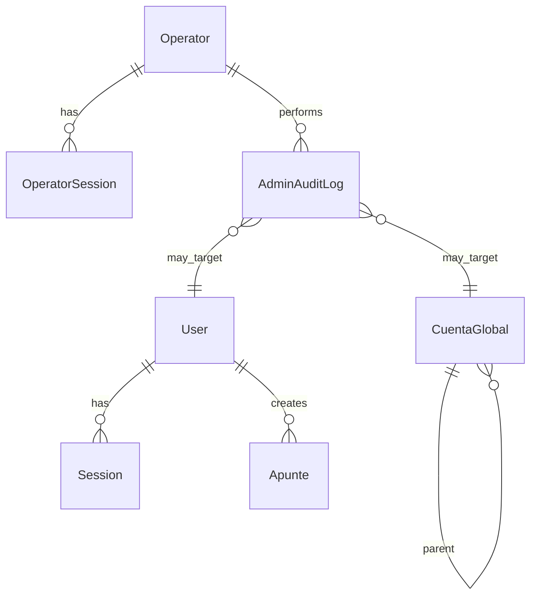

# Data Model: Admin Platform (013)

**Date**: 2026-07-22  
**Status**: Draft

## Overview

Admin platform adds **operator identity**, **admin sessions**, and **audit logging**. It extends the existing `User` model for block status. Product tenant models (`Book`, `CuentaGlobal`, `Apunte`, etc.) are consumed by admin use cases but remain owned by their existing domains.

## New Entities

### Operator

Internal platform user. Not a product `User`.

| Field | Type | Notes |
|-------|------|-------|
| `id` | `cuid` | PK |
| `email` | `string` unique | Login identifier |
| `passwordHash` | `string` | Argon2 |
| `displayName` | `string?` | UI only |
| `role` | `OperatorRole` enum | `support`, `admin`, `superadmin` |
| `mustChangePassword` | `boolean` | `false` dev; `true` staging/prod on bootstrap |
| `passwordChangedAt` | `DateTime?` | Set when operator completes forced or voluntary password change |
| `blockedAt` | `DateTime?` | Manual operator lockout |
| `lastLoginAt` | `DateTime?` | Analytics |
| `createdAt` / `updatedAt` | `DateTime` | Audit |

**Bootstrap**: First `superadmin` created by `ensureBootstrapOperator()` after migrate when table is empty. See [auth-bootstrap.md](./auth-bootstrap.md).

### OperatorRole (enum)

| Value | Capabilities (MVP) |
|-------|-------------------|
| `support` | Read users, read statistics, template preview |
| `admin` | support + block/unblock users, force recovery, CRUD `CuentaGlobal` |
| `superadmin` | admin + manage operators, read full audit log export |

### OperatorSession

| Field | Type | Notes |
|-------|------|-------|
| `id` | `cuid` | PK |
| `operatorId` | FK → Operator | |
| `token` | `string` unique | Opaque, hashed at rest optional (match product Session pattern) |
| `expiresAt` | `DateTime` | Shorter TTL than product recommended (e.g. 8h) |
| `createdAt` | `DateTime` | Also used as login event for operator stats (optional) |
| `ipAddress` | `string?` | Audit (optional MVP) |
| `userAgent` | `string?` | Audit (optional MVP) |

Cookie: `admin_session` (distinct from product session cookie).

### AdminAuditLog

Append-only.

| Field | Type | Notes |
|-------|------|-------|
| `id` | `cuid` | PK |
| `operatorId` | FK → Operator | Who |
| `action` | `string` | e.g. `user.block`, `global_account.update` |
| `targetType` | `string` | e.g. `User`, `CuentaGlobal` |
| `targetId` | `string?` | Entity id |
| `payloadBefore` | `Json?` | Redacted snapshot |
| `payloadAfter` | `Json?` | Redacted snapshot |
| `metadata` | `Json?` | IP, user-agent, request id |
| `createdAt` | `DateTime` | Immutable |

Indexes: `(createdAt)`, `(operatorId, createdAt)`, `(targetType, targetId)`.

## Extensions to Existing Entities

### User (product)

| New field | Type | Notes |
|-----------|------|-------|
| `blockedAt` | `DateTime?` | Null = active |
| `blockedReason` | `string?` | Internal note for operators |

**Auth change**: `login` MUST reject when `blockedAt` is set (generic error, no enumeration).

**No `systemRole` on User**: Operator identity is separate from product users (see ADR 0006).

### CuentaGlobal (unchanged schema, admin operations)

Admin service uses existing fields:

- `codigo`, `nombre`, `descripcion`, `esPostable`, `parentId`, hierarchy

Validation rules: `specs/foundation/plan-de-cuentas/reglas-plan-cuentas.md`.

### Session (product)

Used for statistics: `Session.createdAt` ≈ login event.

### Apunte (product)

Used for statistics: `Apunte.createdAt`.

## Optional Future Entities

### UsageDailyRollup

| Field | Type |
|-------|------|
| `date` | `date` PK |
| `newUsers` | `int` |
| `sessionsCreated` | `int` |
| `distinctActiveUsers` | `int` |
| `apuntesCreated` | `int` |

Populated by nightly job if live aggregation is too slow.

## ER Diagram (admin slice)

## Migration Notes

1. Add nullable `blockedAt` / `blockedReason` to `users` — non-breaking.
2. Create `operators`, `operator_sessions`, `admin_audit_logs` tables.
3. No changes to ledger tables in phase 0.
4. `ensureBootstrapOperator()` — idempotent post-migrate; see [auth-bootstrap.md](./auth-bootstrap.md).

## Privacy & Retention

- Audit logs: retain minimum 1 year (configurable); no passwords or tokens in payloads.
- Statistics: aggregated by default; per-user drill-down limited to `admin`+ and audit-logged.
